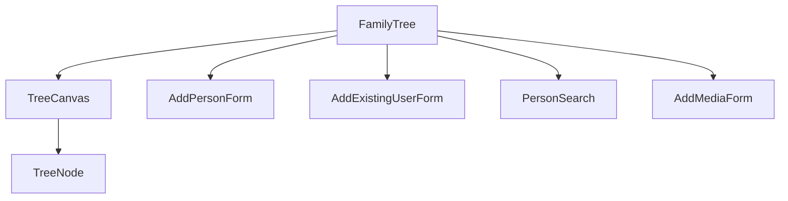

# TreeMaker

A family tree visualization application built with SvelteKit and TypeScript.

## Tech Stack

- **Frontend Framework**: SvelteKit 2.16.0 with Svelte 5.0.0
- **Styling**: TailwindCSS
- **Database**: SQLite with Prisma ORM
- **Build Tool**: Vite 6.0.0
- **Language**: TypeScript 5.0.0

## EnhancedFamilyTree Component Overview

The `EnhancedFamilyTree` component is the main controller for rendering and managing an interactive family tree visualization. It handles loading and maintaining data for people, tree nodes, and associated media, and provides user interfaces for adding, editing, and deleting people and relationships.

### Key Associated Components

- **TreeCanvas.svelte**: Responsible for rendering the family tree layout. It calculates node positions based on family relationships (parents, children, siblings) and renders connection lines between nodes. It supports zooming, panning, and node selection. It also includes a side panel for detailed person information and actions.

- **EnhancedTreeNode.svelte**: Renders individual nodes in the tree, displaying person details such as photo, name, and birth/death years. It provides UI for selecting and deleting nodes with confirmation.

- **AddPersonForm.svelte** and **AddExistingUserForm.svelte**: Used within modals to add new people or link existing users to the tree.

- **PersonSearch.svelte**: Provides search functionality to find existing people when adding them to the tree.

- **AddMediaForm.svelte**: Allows adding photos or other media to a person in the tree.

### Component Interaction Diagram



This architecture cleanly separates concerns: `FamilyTree` manages data and state, `TreeCanvas` handles layout and rendering, and `TreeNode` manages individual node UI. The form components support user input workflows.

## Usage

The `FamilyTree` component expects props such as `treeId`, and optionally arrays of `people`, `nodes`, and `media`. It fetches data if not provided and emits events for person additions, updates, and errors.
# TreeMaker

A family tree visualization application built with SvelteKit and TypeScript.

## Tech Stack

- **Frontend Framework**: SvelteKit 2.16.0 with Svelte 5.0.0
- **Styling**: TailwindCSS
- **Database**: SQLite with Prisma ORM
- **Build Tool**: Vite 6.0.0
- **Language**: TypeScript 5.0.0

## Prerequisites

- Node.js
- npm/pnpm/yarn
- SQLite

## Setup

1. Clone the repository
2. Install dependencies:
```bash
npm install
```

3. Set up the database:
```bash
# Initialize Prisma
npx prisma generate

# Run migrations
npx prisma migrate dev
```

## Development

Start the development server:

```bash
npm run dev

# or start the server and open the app in a new browser tab
npm run dev -- --open
```

## Building

To create a production version of the app:

```bash
npm run build
```

You can preview the production build with `npm run preview`.

## Available Scripts

- `npm run dev` - Start development server
- `npm run build` - Build for production
- `npm run preview` - Preview production build
- `npm run check` - Run type checking
- `npm run check:watch` - Run type checking in watch mode
- `npm run prepare` - Sync SvelteKit files

## Dependencies

### Production Dependencies
- @prisma/client: ^6.3.0
- prisma: ^6.3.0
- sqlite3: ^5.1.7

### Development Dependencies
- @sveltejs/adapter-auto: ^4.0.0
- @sveltejs/kit: ^2.16.0
- @sveltejs/vite-plugin-svelte: ^5.0.0
- @tailwindcss/postcss: ^4.0.0
- @tailwindcss/vite: ^4.0.0
- @types/node: ^22.12.0
- autoprefixer: ^10.4.20
- svelte: ^5.0.0
- svelte-check: ^4.0.0
- typescript: ^5.0.0
- vite: ^6.0.0

> Note: To deploy your app, you may need to install an [adapter](https://svelte.dev/docs/kit/adapters) for your target environment.
