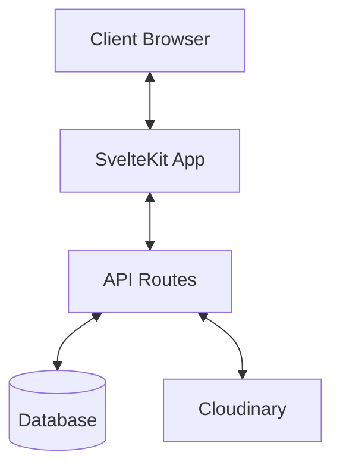
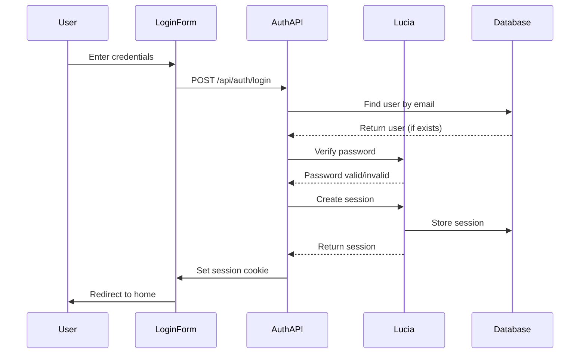
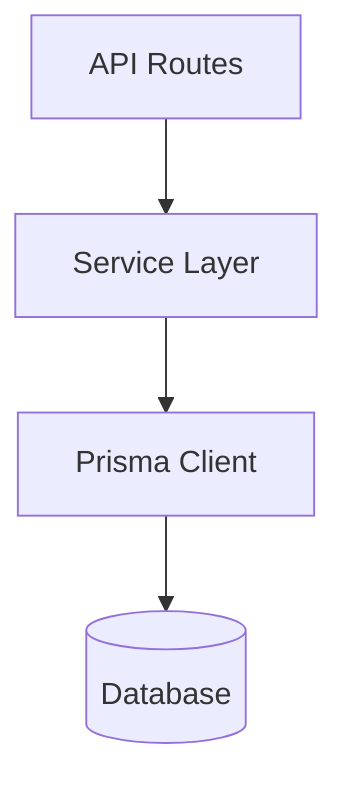
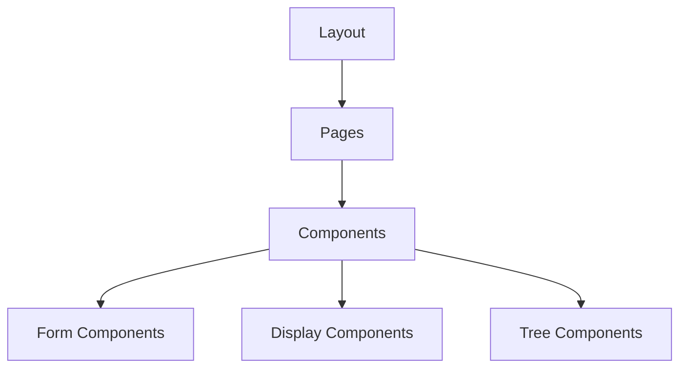

# System Patterns

## Architecture Overview

TreeMaker follows a typical SvelteKit architecture with server and client components:

## Key Design Patterns

### Authentication Flow

### Data Access Pattern

The application uses a service-based pattern for data access:

### Component Hierarchy

## Key System Components

### Authentication System
- **Lucia**: Core authentication library
- **Custom Prisma Adapter**: Database integration
- **Session Management**: Cookie-based sessions
- **Two-Factor Authentication**: Optional TOTP-based 2FA

### Family Tree Management
- **Tree Service**: CRUD operations for trees
- **Person Service**: CRUD operations for people
- **Relationship Service**: Manages connections between people
- **Media Service**: Handles media uploads and retrieval

### UI Components
- **Tree Visualization**: Interactive tree display
- **Person Cards**: Display person information
- **Relationship Editor**: Manage relationships
- **Media Gallery**: Display and manage media

## Data Flow Patterns

### Tree Creation and Editing
1. User creates/selects a tree
2. User adds/edits people in the tree
3. User establishes relationships between people
4. User adds media to people
5. Tree is visualized with the updated information

### Authentication Flow
1. User registers or logs in
2. Session is created and stored
3. User is authenticated for subsequent requests
4. Optional 2FA verification
5. Session is refreshed as needed

## Error Handling Patterns
- API routes return standardized error responses
- Client-side form validation
- Server-side validation
- Detailed error logging for debugging
